# NetworkMatch App Flow Documentation

The screenshots below were captured from a temporary demo event and map directly to the current codebase behavior.

## System Overview

NetworkMatch is split into three main parts:

- `admin/`: the host-facing Next.js app used to create and control networking events.
- `user/`: the attendee-facing mobile-first Next.js app used to join, wait in the lobby, receive matches, and save connections.
- `backend/`: the Express + Socket.IO API that handles auth, events, matching, round timers, saved connections, OTP flows, and LinkedIn follow-up generation.

Core flow:

1. An admin signs in and creates an event.
2. The admin shares the event QR code or join URL.
3. An attendee joins through the mobile flow.
4. The admin starts a round.
5. The backend computes matches and pushes them in real time.
6. Attendees save connections and optionally copy LinkedIn follow-ups.
7. The event can continue into more rounds or be ended by the host.

## Admin Flow

### 1. Admin Login

Route: `/login`  
Source: `admin/app/login/page.tsx`

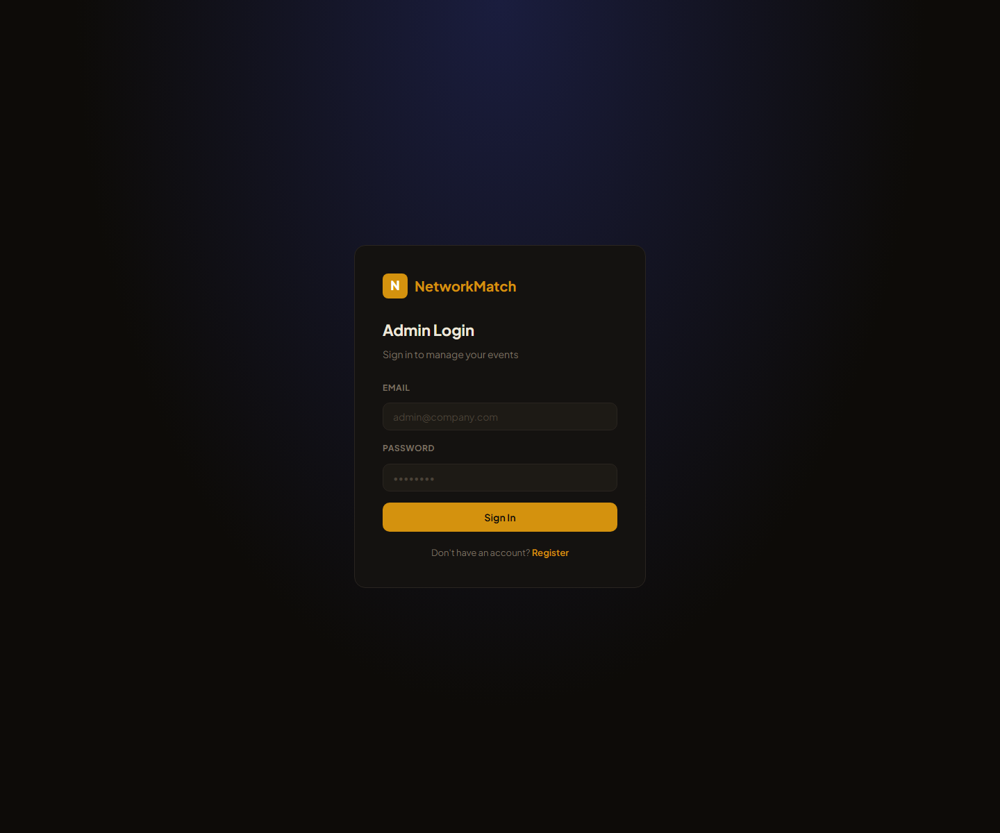

Key functionality:

- Default entry point for admins.
- Accepts email and password.
- Calls `POST /api/admin/login`.
- Stores `admin_token` and `admin_user` in `localStorage`.
- Redirects successful logins to `/dashboard`.

### 2. Admin Registration State

Route: `/login` with the register toggle active  
Source: `admin/app/login/page.tsx`

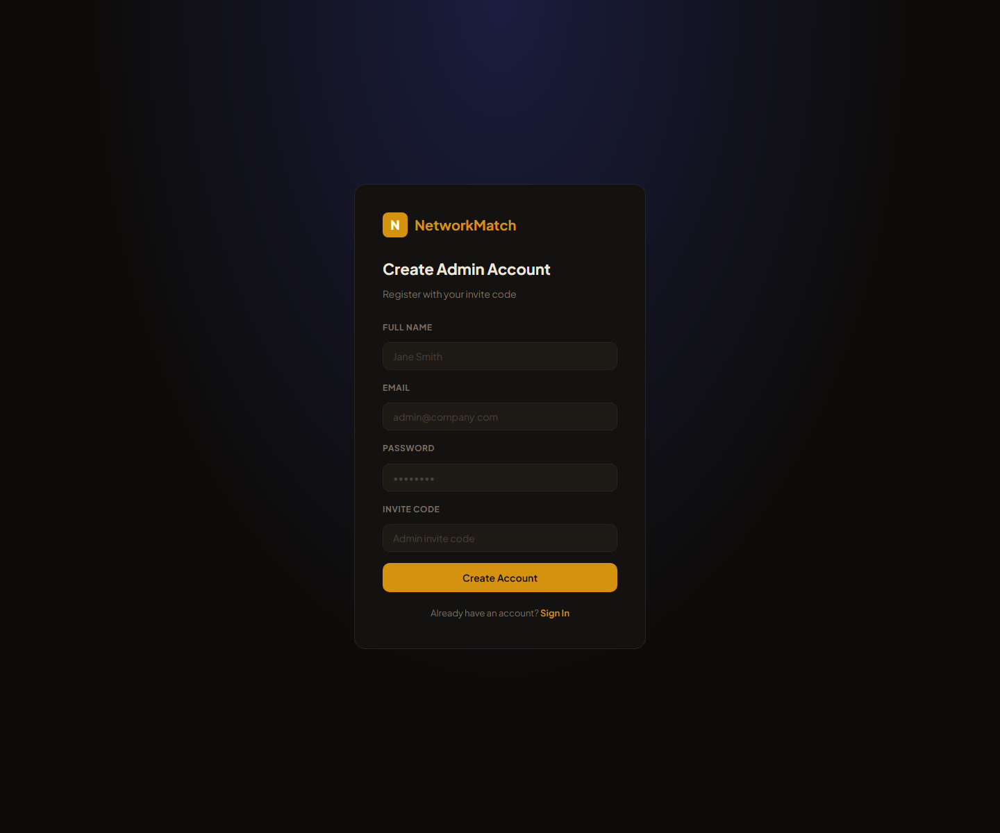

Key functionality:

- Same screen, alternate mode.
- Adds `Full Name` and `Invite Code`.
- Calls `POST /api/admin/register`.
- Uses the backend invite-code gate from `backend/src/routes/admin.js`.

### 3. Dashboard

Route: `/dashboard`  
Source: `admin/app/dashboard/page.tsx`

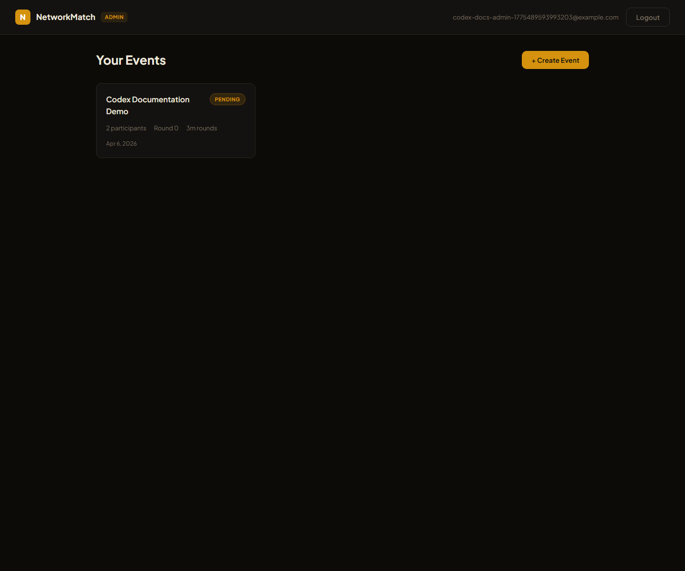

Key functionality:

- Loads the current admin from `localStorage`.
- Calls `GET /api/events`.
- Displays event cards with status, participant count, current round, and round duration.
- Includes logout and delete-event actions.
- Primary navigation point into event creation and event control.

### 4. Create Event

Route: `/dashboard/events/new`  
Source: `admin/app/dashboard/events/new/page.tsx`

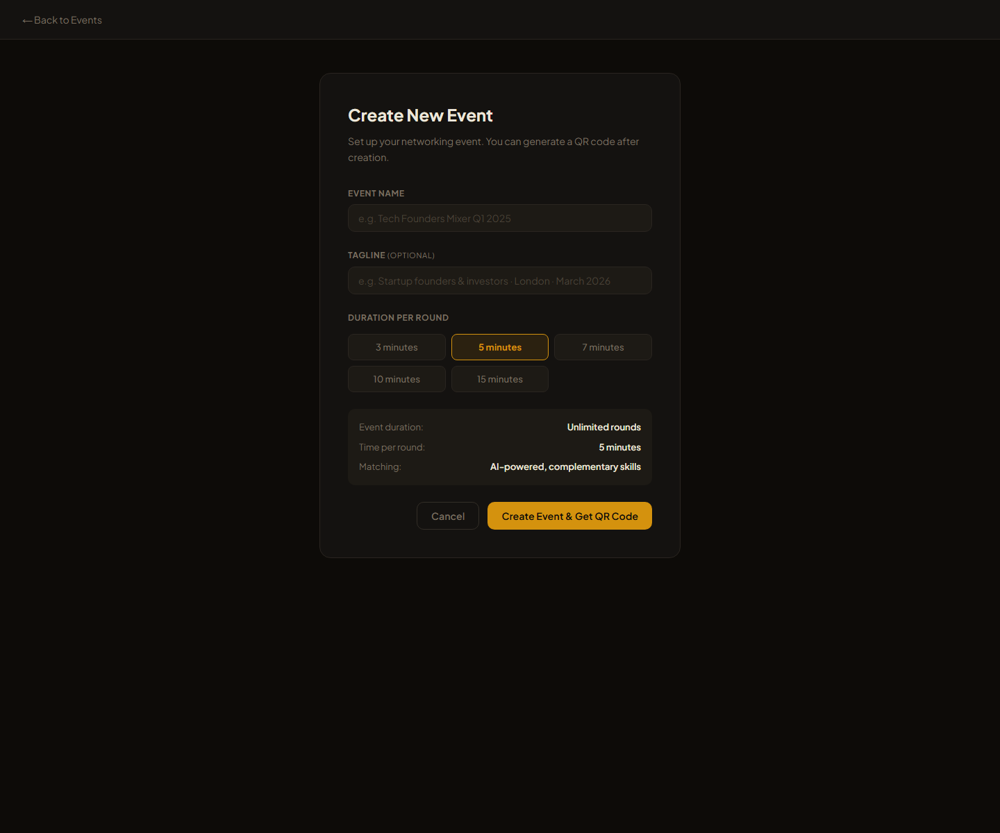

Key functionality:

- Creates a new event name, optional tagline, and round duration.
- Calls `POST /api/events`.
- Duration presets are 3, 5, 7, 10, and 15 minutes.
- Redirects to the event control screen after creation.

### 5. Event Control: Waiting State

Route: `/dashboard/events/[id]`  
Source: `admin/app/dashboard/events/[id]/page.tsx`

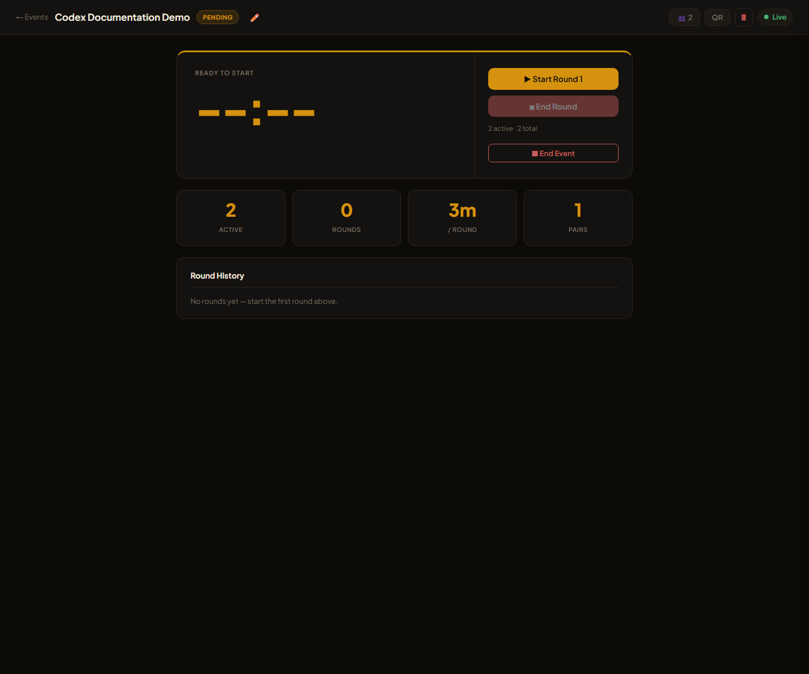

Key functionality:

- Loads event details, participants, QR data, and round history.
- Connects to Socket.IO and joins the event room as the admin.
- Shows event status, active participant count, estimated pairs, and round history.
- Exposes primary controls:
    - `Start Round`
    - `End Round`
    - `End Event`
    - participant drawer
    - QR drawer
    - edit event modal

### 6. Participants Drawer

Route: `/dashboard/events/[id]` with participants drawer open  
Sources:

- `admin/app/dashboard/events/[id]/page.tsx`
- `admin/components/ParticipantList.tsx`

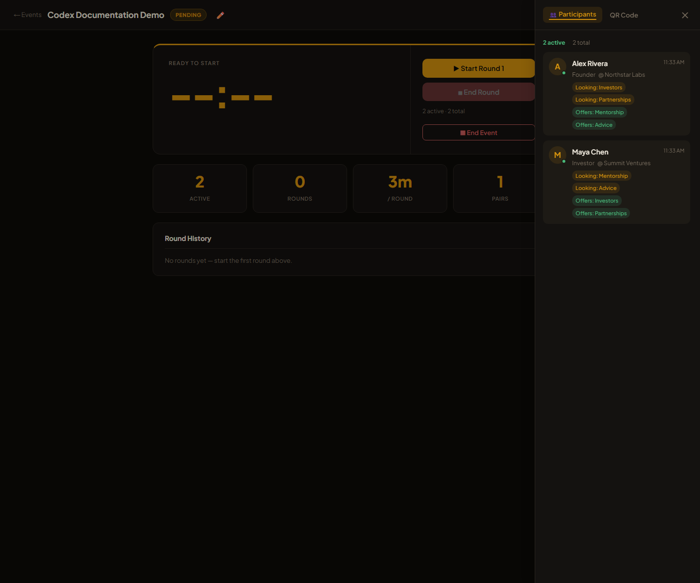

Key functionality:

- Shows active vs total participant counts.
- Lists attendees with:
    - name
    - role/company
    - active/inactive state
    - top `looking_for` and `offering` tags
    - join time
- Updates live from `participant_count` and reloads from `GET /api/events/:id`.

### 7. QR Drawer

Route: `/dashboard/events/[id]` with QR drawer open  
Sources:

- `admin/app/dashboard/events/[id]/page.tsx`
- `admin/components/QRDisplay.tsx`

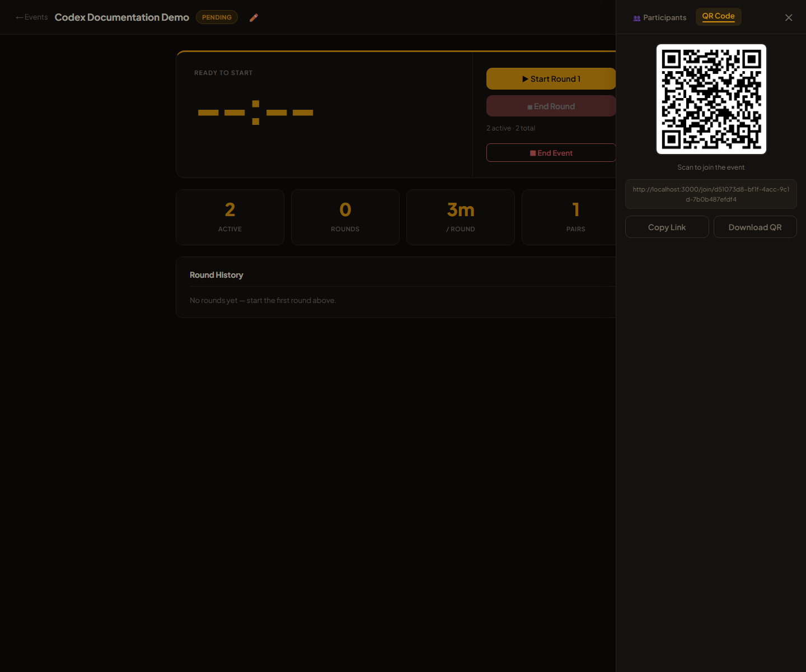

Key functionality:

- Calls `GET /api/events/:id/qr`.
- Shows the scannable QR code and full join URL.
- Supports copy-to-clipboard and PNG download for the QR image.
- This is the bridge from the admin flow into the attendee flow.

### 8. Edit Event Modal

Route: `/dashboard/events/[id]` with edit modal open  
Source: `admin/app/dashboard/events/[id]/page.tsx`

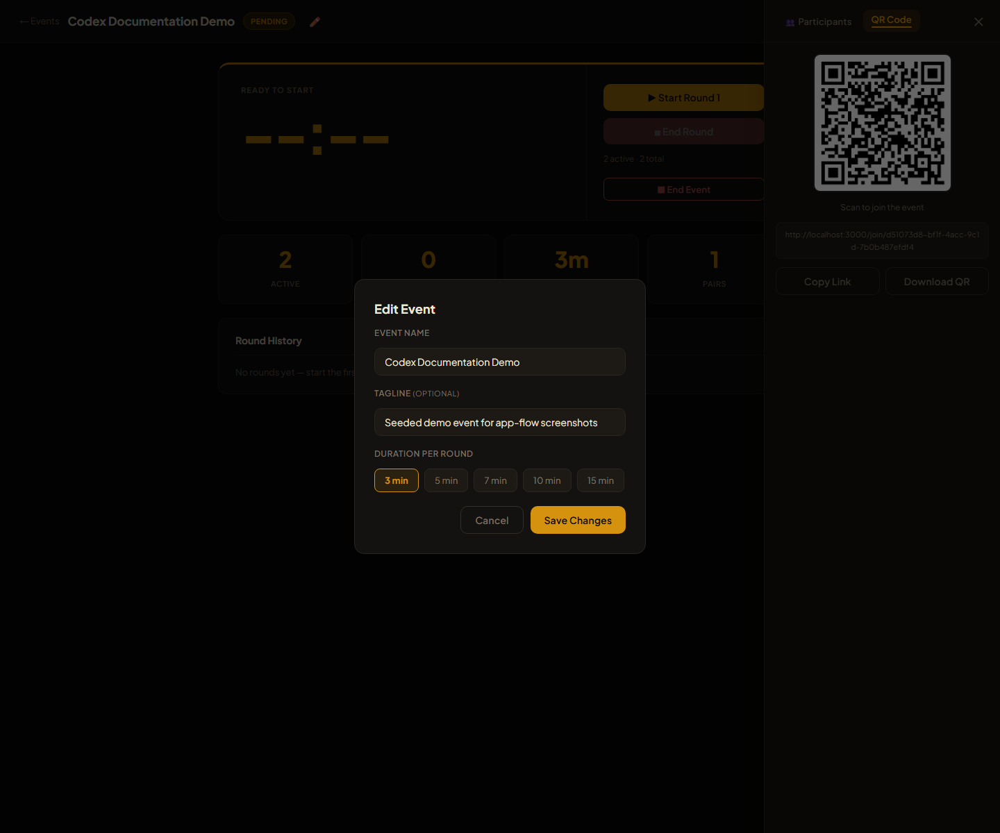

Key functionality:

- Allows editing:
    - event name
    - tagline
    - duration per round
- Calls `PUT /api/events/:id`.
- Updates the live page state after a successful save.

### 9. Event Control: Active Round

Route: `/dashboard/events/[id]` during an active round  
Source: `admin/app/dashboard/events/[id]/page.tsx`

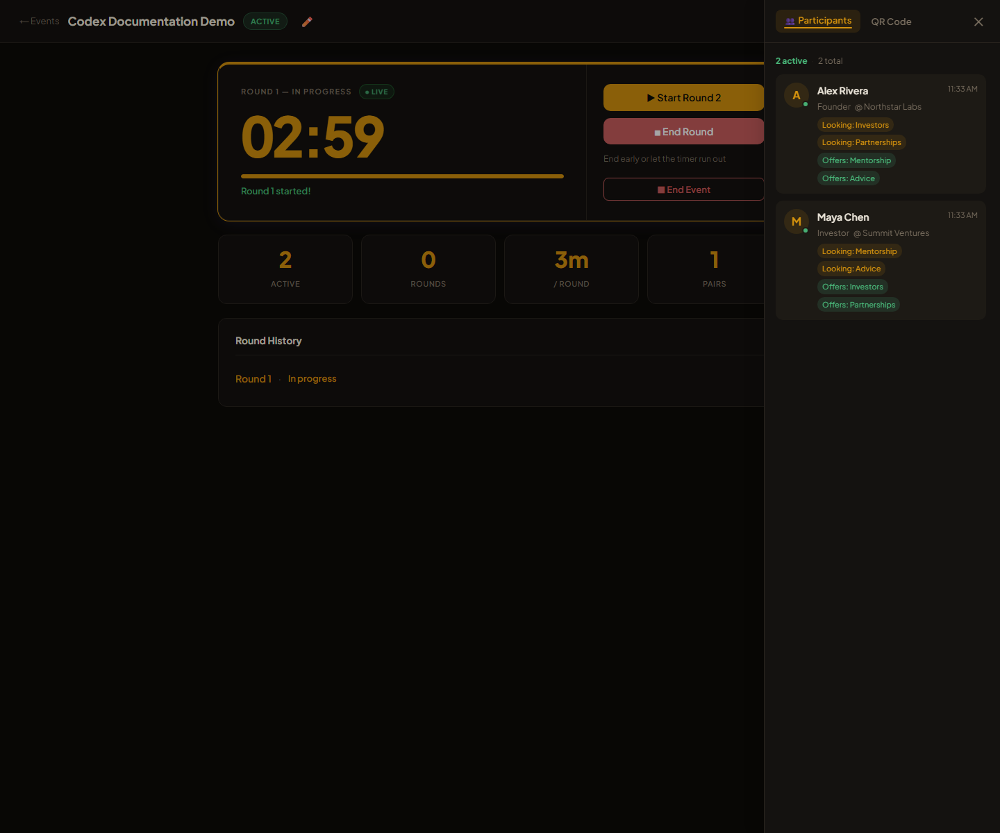

Key functionality:

- Triggered by `start_round` over Socket.IO.
- Displays:
    - live round label
    - countdown timer
    - active round history row
    - disabled/enabled control states
- The backend:
    - selects active participants
    - runs the matching algorithm
    - inserts `matches`
    - sets `events.status = 'active'`
    - starts the in-memory round timer

### 10. Event Control: Ended State

Route: `/dashboard/events/[id]` after the event is ended  
Source: `admin/app/dashboard/events/[id]/page.tsx`

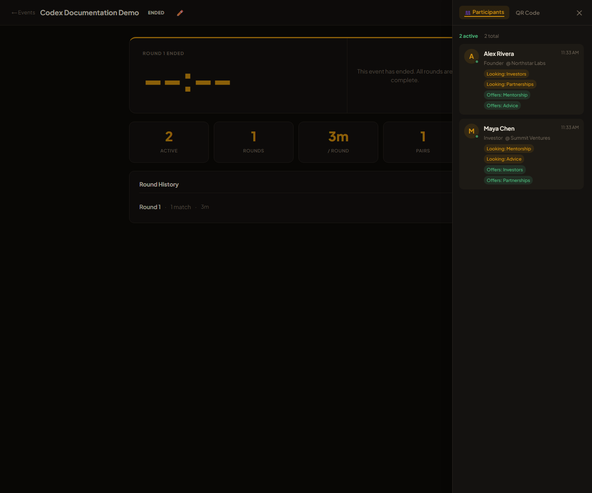

Key functionality:

- Triggered by `end_event` over Socket.IO.
- Shows the event as ended and prevents additional rounds.
- Preserves round history and participant visibility.
- Mirrors the backend `event_ended` broadcast to connected attendees.

## Attendee Flow

### 1. Guest Home

Route: `/` when not signed in  
Source: `user/app/page.tsx`

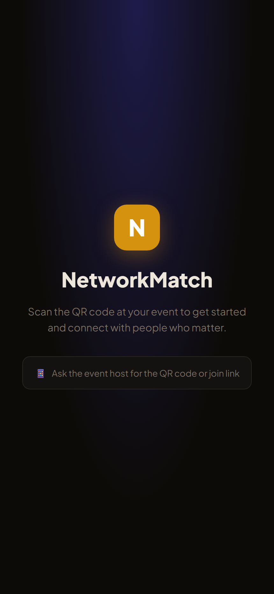

Key functionality:

- Empty landing state for people who have not joined an event.
- Explains that the attendee should scan the host QR code or use a join link.
- No backend auth required for this state.

### 2. Join Screen: Email Step

Route: `/join/[eventId]`  
Source: `user/app/join/[eventId]/page.tsx`

Key functionality:

- Loads public event info from `GET /api/events/:id/public`.
- First step asks only for email.
- Calls `POST /api/users/lookup` to decide whether the attendee is returning or new.
- Also supports a same-device shortcut if `nm_user` and `nm_event_id` already exist in `localStorage`.

### 3. Join Screen: Returning User Login

Route: `/join/[eventId]` in login state  
Source: `user/app/join/[eventId]/page.tsx`

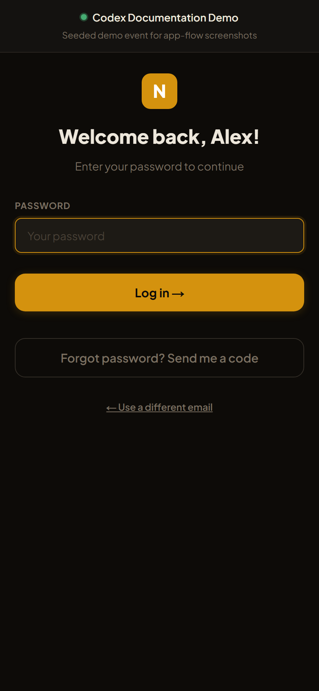

Key functionality:

- Shown when `lookup` finds an existing attendee email.
- Accepts password and calls `POST /api/users/login`.
- On success, immediately calls `POST /api/users/join` using `user_id` to attach that person to the event.

### 4. Join Screen: OTP Recovery

Route: `/join/[eventId]` in OTP state  
Source: `user/app/join/[eventId]/page.tsx`

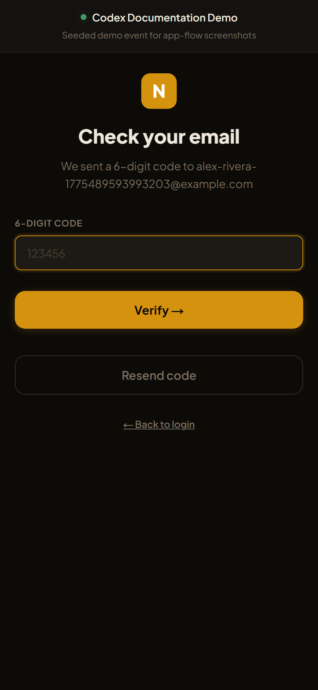

Key functionality:

- Reached from `Forgot password? Send me a code`.
- Calls `POST /api/users/otp/send`.
- Verifies with `POST /api/users/otp/verify`.
- Lets a returning attendee recover access without remembering their password.

### 5. Join Screen: New User Registration

Route: `/join/[eventId]` in register state  
Source: `user/app/join/[eventId]/page.tsx`

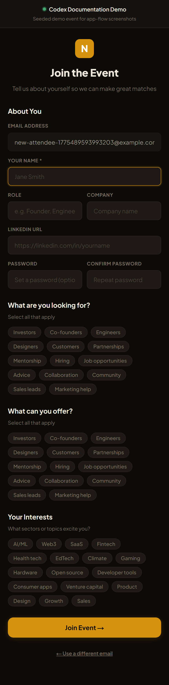

Key functionality:

- Full onboarding profile form for first-time attendees.
- Captures:
    - name
    - LinkedIn URL
    - role
    - company
    - optional password
    - `looking_for`
    - `offering`
    - `interests`
- Calls `POST /api/users/join`.
- This profile is what the matching algorithm uses later.

### 6. Lobby

Route: `/event/[eventId]/lobby`  
Source: `user/app/event/[eventId]/lobby/page.tsx`

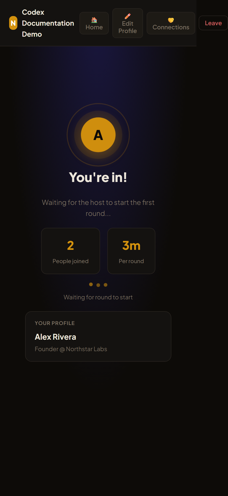

Key functionality:

- Main waiting room after a successful join.
- Connects to the event room over Socket.IO.
- Shows:
    - attendee profile summary
    - current joined count
    - per-round duration
    - actions for home, edit profile, connections, and leave event
- If the event is already active, the page redirects to `/match`.

### 7. Match Screen

Route: `/event/[eventId]/match`  
Sources:

- `user/app/event/[eventId]/match/page.tsx`
- `user/components/MatchCard.tsx`
- `user/components/TimerRing.tsx`

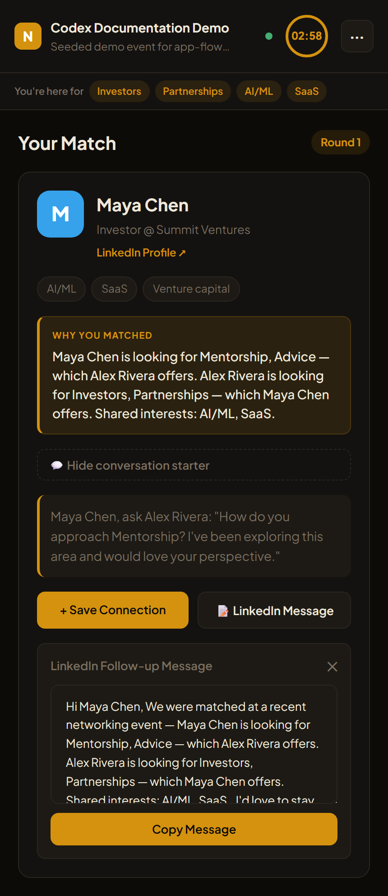

Key functionality:

- Shows the current round, timer ring, and live connection status.
- Loads the attendee’s current match from `GET /api/events/:id/my-match`.
- Updates in real time from:
    - `match_assigned`
    - `timer_tick`
    - `round_started`
    - `round_ended`
    - `event_ended`
- Each match card supports:
    - viewing LinkedIn profile
    - reading the match reason
    - showing a conversation starter
    - saving the connection
    - generating a LinkedIn follow-up draft

### 8. Round Complete Overlay

Route: `/event/[eventId]/match` with round-end overlay  
Source: `user/components/RoundEndOverlay.tsx`

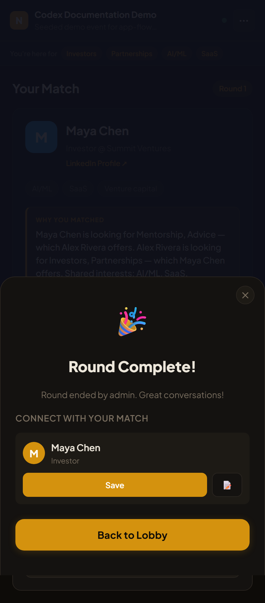

Key functionality:

- Appears when the backend emits `round_ended`.
- Gives attendees a last chance to save the connection before returning to the lobby.
- Supports lightweight LinkedIn message generation from the overlay itself.
- Helps turn the live round into a durable saved connection.

### 9. Signed-In Home

Route: `/` when signed in  
Source: `user/app/page.tsx`

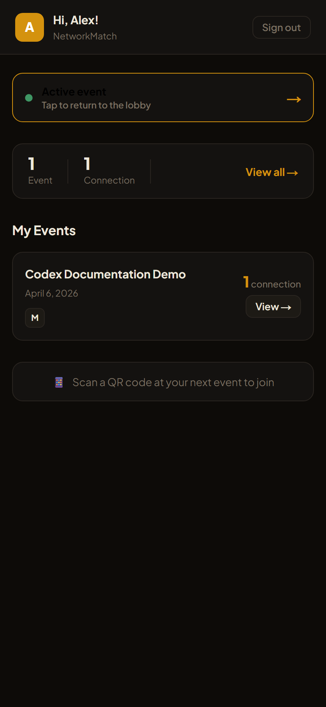

Key functionality:

- Personalized attendee home screen.
- Shows:
    - greeting header
    - active event banner when `nm_event_id` is still active
    - per-event saved connection history
    - quick entry into `/connections`
- Calls `GET /api/users/me/connections`.

### 10. Connections

Route: `/connections`  
Source: `user/app/connections/page.tsx`

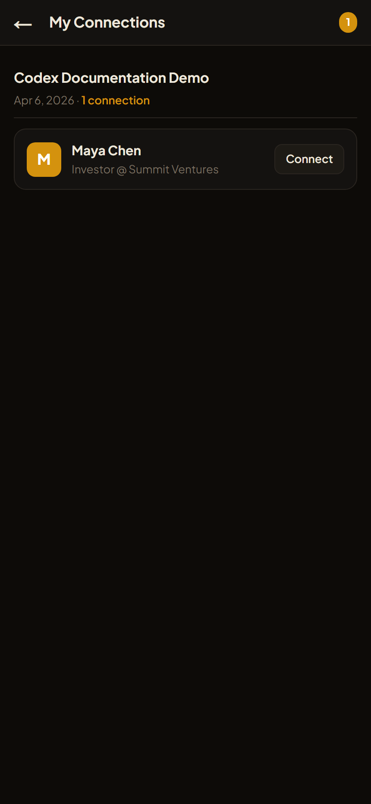

Key functionality:

- Lists saved connections grouped by event.
- Shows event name, date, count, and per-person cards.
- Displays a `Connect` button when a LinkedIn URL is available.
- Powered by `GET /api/users/me/connections`.

### 11. Event Ended State

Route: `/event/[eventId]/lobby` when the event has ended  
Source: `user/app/event/[eventId]/lobby/page.tsx`

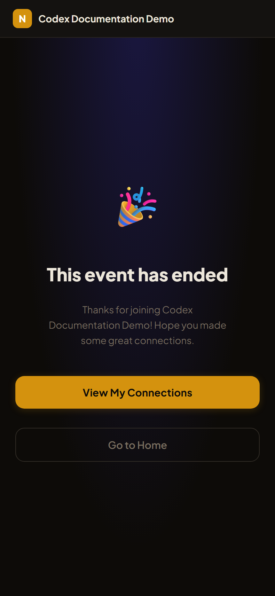

Key functionality:

- Terminal attendee state after the host ends the event.
- Gives a clear path back to `View My Connections` or home.
- Keeps the attendee out of the active networking flow once the host closes the event.

## Matching Logic

Source: `backend/src/matching/algorithm.js`

Matching priority order:

1. Complementary matching: attendee A wants what attendee B offers, and vice versa.
2. Shared interests.
3. Same role.
4. Same company.
5. Random fallback when nothing stronger exists.

Important behavior:

- Previous pairs are penalized heavily to avoid repeats within the same event.
- Odd participant counts are resolved by promoting one pair into a trio.
- The backend stores both a human-readable `reason` and a `conversation_starter` for each match.

## Persistence Model

Source: `backend/src/db/schema.sql`

Key tables:

- `admins`
- `users`
- `events`
- `event_participants`
- `matches`
- `saved_connections`

What gets stored:

- admin identities
- attendee profiles and optional login credentials
- event metadata and status
- active event participation
- match history by round
- saved follow-up connections

## Notes

- The screenshots cover the primary route-level screens plus the key UI states that materially change the workflow:
    - registration/login states
    - drawers
    - modal/edit state
    - active round state
    - round-end overlay
    - ended-state screens

## Route Map

### Admin routes

- `/login`
- `/dashboard`
- `/dashboard/events/new`
- `/dashboard/events/[id]`

### Attendee routes

- `/`
- `/join/[eventId]`
- `/event/[eventId]/lobby`
- `/event/[eventId]/match`
- `/connections`
